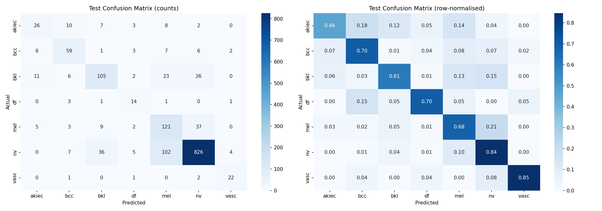

# Skin Lesion Classification with Deep Learning

Multi-class classification of dermatoscopic images into seven diagnostic categories, built on the HAM10000 dataset with PyTorch.

> **Disclaimer:** This is an academic project built for learning purposes. It is not a medical device and must not be used for diagnosis.

---

## Summary

The interesting problem in HAM10000 is not accuracy — it is imbalance. One class (benign nevi) holds 67% of the images while the rarest holds 1.1%, a ratio of 58:1. A model that predicts the majority class for every image scores 66.6% accuracy while catching zero melanomas.

This project works through that problem in four controlled experiments, changing one variable at a time, and ends with an analysis of where the model still fails.

**Final test performance:** 77.4% accuracy, 0.658 macro F1, 0.684 melanoma recall.

---

## Dataset

[HAM10000](https://www.kaggle.com/datasets/kmader/skin-cancer-mnist-ham10000) — 10,015 dermatoscopic images, 7 classes, collected in Austria and Australia.

| Code | Diagnosis | Images | Share |
|------|-----------|--------|-------|
| nv | Melanocytic nevi | 6,705 | 66.9% |
| mel | Melanoma | 1,113 | 11.1% |
| bkl | Benign keratosis | 1,099 | 11.0% |
| bcc | Basal cell carcinoma | 514 | 5.1% |
| akiec | Actinic keratoses | 327 | 3.3% |
| vasc | Vascular lesions | 142 | 1.4% |
| df | Dermatofibroma | 115 | 1.1% |

### Data leakage

The dataset contains 10,015 images but only 7,470 unique lesions — 2,545 images are repeat photographs of the same lesion. A random split scatters these across train and test, letting the model recognise memorised lesions rather than learn general features.

All splits are therefore grouped by `lesion_id` using `GroupShuffleSplit`. This is verified explicitly rather than assumed:

```
Train-Val overlap : 0
Train-Test overlap: 0
Val-Test overlap  : 0
```

Split sizes: 6,990 train / 1,509 validation / 1,516 test.

---

## Experiments

Each experiment changes exactly one variable from the previous one.

| Exp | Model | Change | Accuracy | Macro F1 | mel Recall | df Recall |
|-----|-------|--------|----------|----------|------------|-----------|
| 1 | Baseline CNN | from scratch, no weights | 0.746 | 0.411 | 0.236 | 0.000 |
| 2 | Baseline CNN | + class weights | 0.573 | 0.395 | 0.624 | 0.333 |
| 3 | ResNet18 | + pretrained, lr 1e-4 | 0.744 | 0.593 | 0.655 | 0.611 |
| 4 | ResNet18 | + LR scheduler | 0.755 | 0.623 | 0.636 | 0.722 |

*(validation set; the test set was evaluated once, at the end)*

**Experiment 1 — the accuracy trap.** 74.6% accuracy looks acceptable until you check per-class recall: melanoma 0.236, dermatofibroma 0.000. The model never predicted dermatofibroma once. Macro F1 of 0.411 against a weighted F1 of 0.709 is the gap that exposes this.

**Experiment 2 — weighting moves the problem, it does not solve it.** Inverse-frequency weighting raised melanoma recall from 0.236 to 0.624, but melanoma precision fell from 0.600 to 0.279 and macro F1 slightly decreased. The model shifted its bias from one direction to the other, because its features were never strong enough to separate the classes.

**Experiment 3 — better features fix both sides.** An ImageNet-pretrained ResNet18 improved recall and precision for all seven classes simultaneously — 14 of 14 metrics. Macro F1 jumped from 0.395 to 0.593. Experiments 1 and 3 reach nearly identical accuracy (0.746 vs 0.744) with completely different macro F1 (0.411 vs 0.593), which is the clearest demonstration here of why accuracy alone is insufficient.

**Experiment 4 — scheduling.** Validation loss in Experiment 3 oscillated, reaching 0.746 at epoch 3 then worsening to 0.876 by epoch 5. Halving the learning rate on plateau smoothed convergence and lifted macro F1 to 0.623.

---

## Final Test Results

Evaluated once on the held-out test set, after all tuning was complete.

| Metric | Value |
|--------|-------|
| Accuracy | 0.774 |
| Macro F1 | 0.658 |
| Weighted F1 | 0.782 |
| Macro Recall | 0.692 |
| Majority-class baseline | 0.666 |

| Class | Recall | Precision | F1 | Support |
|-------|--------|-----------|-----|---------|
| akiec | 0.464 | 0.542 | 0.500 | 56 |
| bcc | 0.702 | 0.663 | 0.682 | 84 |
| bkl | 0.607 | 0.660 | 0.633 | 173 |
| df | 0.700 | 0.467 | 0.560 | 20 |
| mel | 0.684 | 0.462 | 0.551 | 177 |
| nv | 0.843 | 0.919 | 0.879 | 980 |
| vasc | 0.846 | 0.759 | 0.800 | 26 |



Test scores came out slightly above validation scores, suggesting the model did not overfit to the validation set — a consequence of the leakage-free split.

---

## Error Analysis

The dominant error is bidirectional confusion between melanoma and benign nevi: 37 melanomas labelled nevi, 102 nevi labelled melanoma. Visual inspection during EDA had already flagged these two classes as the most similar.

Examining the 37 missed melanomas revealed something more useful: **in 36 of 37 cases, melanoma was the model's second-ranked prediction.** The signal was present; `argmax` discarded it.

### Threshold analysis

Rather than taking the argmax, flagging any lesion whose melanoma probability exceeds a threshold trades false alarms for recall:

| Threshold | mel Recall | Caught | Missed | False alarms | Precision |
|-----------|------------|--------|--------|--------------|-----------|
| argmax | 0.684 | 121 | 56 | — | 0.462 |
| 0.30 | 0.774 | 137 | 40 | 204 | 0.402 |
| 0.25 | 0.814 | 144 | 33 | 231 | 0.384 |
| **0.20** | **0.864** | **153** | **24** | **271** | **0.361** |
| 0.10 | 0.944 | 167 | 10 | 368 | 0.312 |

At a threshold of 0.20, melanoma recall rises from 0.684 to 0.864 — 32 additional cancers caught, at roughly five extra false alarms each. For a triage tool, where a false alarm costs an unnecessary consultation and a missed melanoma can cost a life, that trade is defensible. Below 0.15 the system flags more than a quarter of all images, which would defeat its purpose.

The model did not change. Only the decision rule did.

> **Caveat:** this sweep was performed on the test set for illustration. In a deployed system the operating point must be chosen on validation data, since selecting it on test makes the reported recall optimistic.

---

## Limitations

- **Skin tone.** HAM10000 is drawn almost entirely from Fitzpatrick I-III populations. Performance on darker skin is untested and should not be assumed.
- **Imaging.** All images are dermatoscopic. The model is not validated on smartphone photographs.
- **Label quality.** Only 53% of labels are histopathologically confirmed; the rest rest on follow-up or expert consensus.
- **Rare-class estimates.** Dermatofibroma has 20 test images. A recall of 0.700 on that support is fragile — two additional errors would drop it to 0.600.
- **Melanoma precision** remains 0.462 at argmax. The model raises many false alarms.

---

## Future Work

1. **Cross-dataset evaluation** on Fitzpatrick 17k or DDI to quantify the skin-tone generalisation gap, particularly for Fitzpatrick III-IV tones which are underrepresented in both HAM10000 and the fairness literature.
2. **Grad-CAM explainability** to check whether the model attends to the lesion itself or to surrounding artefacts.
3. **Diffusion-based augmentation** for minority classes, testing whether synthetic images add information or merely repeat what is already there.
4. **Uncertainty-aware rejection** — mean confidence on wrong melanoma predictions was 0.678, suggesting a rejection threshold could route uncertain cases to human review.

---

## Repository Structure

```
.
├── Deep_Learning_project.ipynb      Full pipeline, EDA to evaluation
├── results/
│   ├── experiments.csv              Experiment comparison table
│   ├── mel_threshold_sweep.csv      Threshold analysis
│   ├── test_confusion_matrix.png    Final confusion matrix
│   └── logs/                        Per-experiment JSON records
├── LICENSE
└── README.md
```

---

## Reproducing

1. Download HAM10000 from [Kaggle](https://www.kaggle.com/datasets/kmader/skin-cancer-mnist-ham10000).
2. Open the notebook in Colab with a GPU runtime.
3. Run sections 1–4 once to build the cached arrays (~15 minutes), then sections 5–8.

All seeds are fixed. Every experiment's configuration and full per-class results are stored in `results/logs/`.

**Environment:** Python 3.10, PyTorch 2.x, Google Colab (T4 GPU).

---

## Author

Syed Tahmed Ahmed — [github.com/syed-tahmed](https://github.com/syed-tahmed)

